# FreshFlow - Inventory Management System

A modern, dashboard-driven web application for tracking inventory freshness, reducing waste, and optimizing supply chain operations.

---

## 🌐 Live Cloud Deployment

🚀 **Web Service (Cloud Hosted):**
👉https://freshflow-inventory.onrender.com
> The application is deployed on cloud infrastructure using Render (free tier), enabling remote access, scalability, and real-time usage without local setup.

---

## ☁️ Cloud Integration

FreshFlow is integrated with cloud computing for better scalability and accessibility:

* **Cloud Hosting**: Deployed on Render (Flask backend)
* **Web Access**: Accessible globally via public URL
* **Environment Variables**: Secure configuration using cloud environment settings
* **Scalability**: Automatically handles multiple users via cloud server

> Note: The application backend runs on cloud servers, removing dependency on local machines.


---

# 🚀 Project Preview

## 🏠 Home Page

<p align="center">
  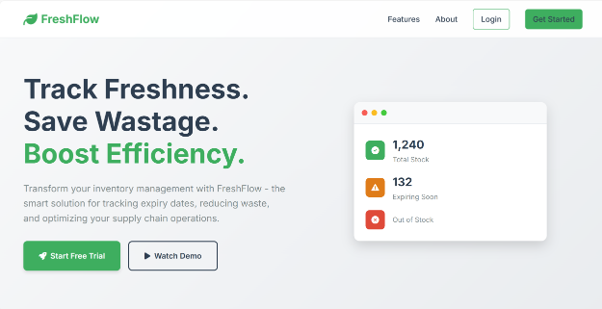
</p>

<p align="center">
  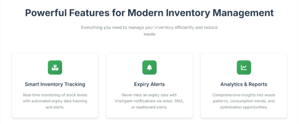
</p>

<p align="center">
  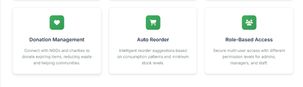
</p>

<p align="center">
  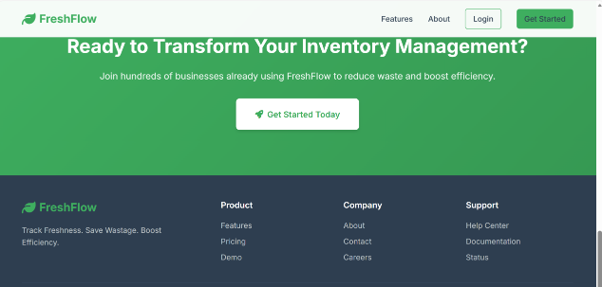
</p>

---

## 👤 Create Account

<p align="center">
  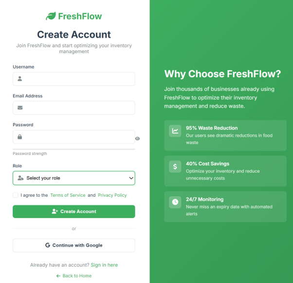
</p>

---

## 🔐 Sign In

<p align="center">
  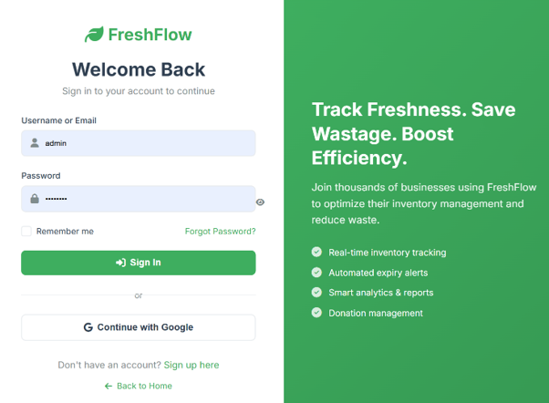
</p>

---

## 📊 Dashboard

<p align="center">
  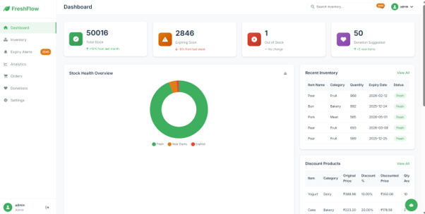
</p>

<p align="center">
  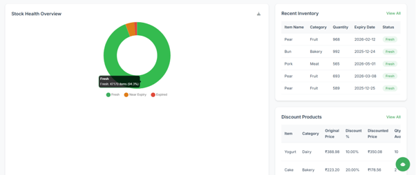
</p>

<p align="center">
  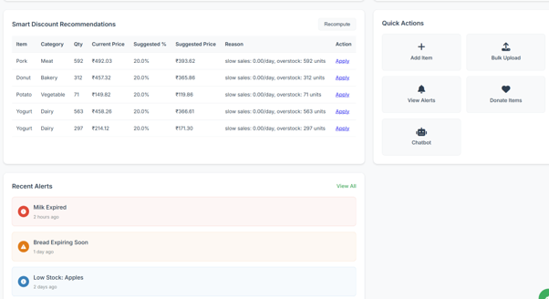
</p>

---

## 🎯 Smart Discount Recommendations

<p align="center">
  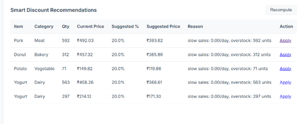
</p>

---

## 💰 Mid Sales Discount

<p align="center">
  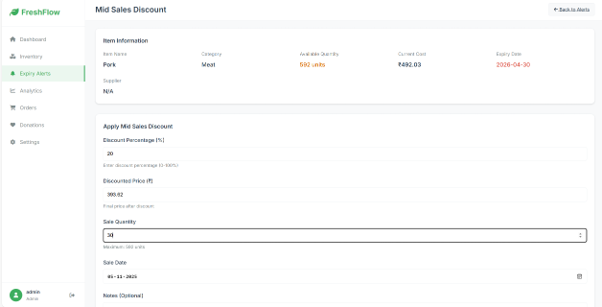
</p>

<p align="center">
  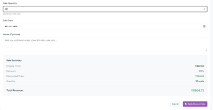
</p>

---

## 📦 Discount Products List

<p align="center">
  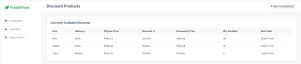
</p>

---

## 📋 Inventory Management

<p align="center">
  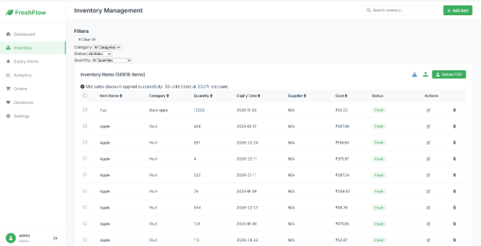
</p>

---

## 📁 CSV File Upload

<p align="center">
  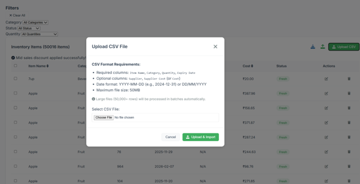
</p>

---

## ⚠️ Expiry Alerts

<p align="center">
  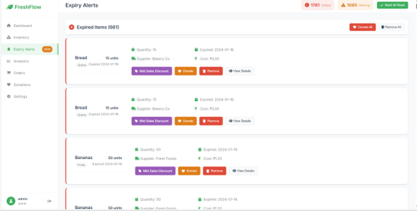
</p>

<p align="center">
  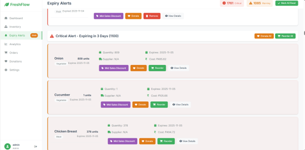
</p>

<p align="center">
  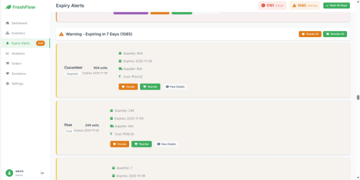
</p>

---

## 📈 Analytics & Reports

<p align="center">
  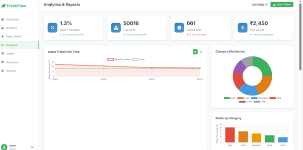
</p>

<p align="center">
  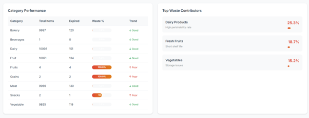
</p>

<p align="center">
  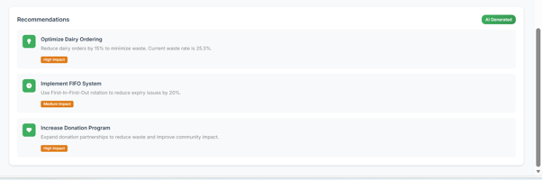
</p>

---

## 🛒 Orders & Reorders

<p align="center">
  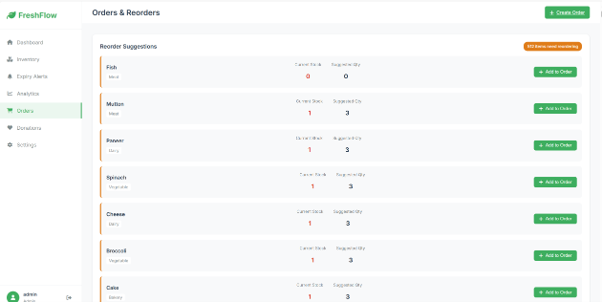
</p>

<p align="center">
  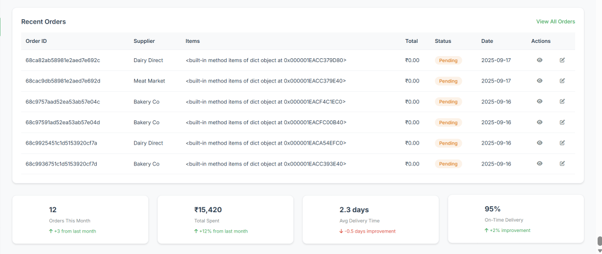
</p>

---

## ❤️ Donations

<p align="center">
  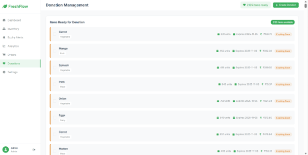
</p>

<p align="center">
  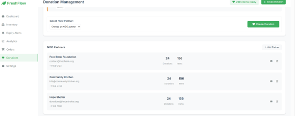
</p>

<p align="center">
  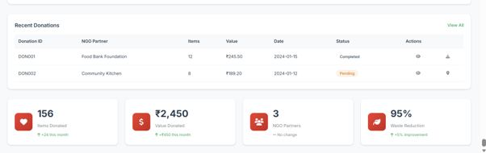
</p>

---

## ⚙️ Settings

<p align="center">
  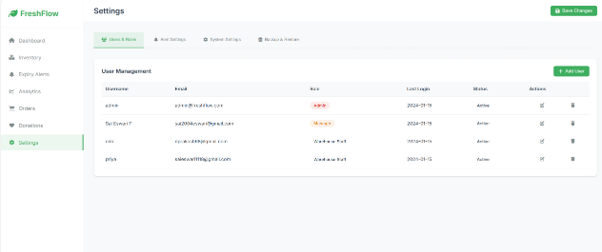
</p>

<p align="center">
  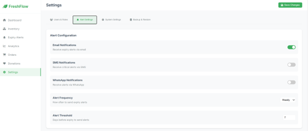
</p>

<p align="center">
  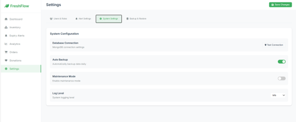
</p>

<p align="center">
  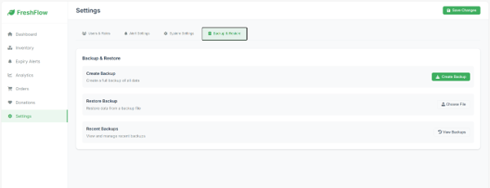
</p>

---


---
## Features

* **Smart Inventory Tracking**: Real-time monitoring of stock levels with automated expiry date tracking
* **Expiry Alerts**: Intelligent notifications via dashboard alerts
* **Analytics & Reports**: Insights into waste patterns and consumption trends
* **Donation Management**: Manage donation of expiring items
* **Auto Reorder**: Suggestions based on stock levels
* **Role-Based Access**: Secure multi-user access

---

## Technology Stack

* **Backend**: Python Flask (Cloud Deployed)
* **Database**: MongoDB
* **Frontend**: HTML5, CSS3, JavaScript
* **Charts**: Chart.js
* **Deployment**: Render (Cloud Platform)

---

## Installation (Local Setup)

1. Clone the repository

```bash
git clone <repository-url>
cd FreshFlow
```

2. Install dependencies

```bash
pip install -r requirements.txt
```

3. Configure environment variables
   Create `.env` file:

```
SECRET_KEY=your-secret-key
MONGO_URI=mongodb://localhost:27017/freshflow
```

4. Run locally

```bash
python app.py
```

---

## Cloud Deployment (Render)

1. Push project to GitHub
2. Create Web Service in Render
3. Configure:

* **Build Command**

```bash
pip install -r requirements.txt
```

* **Start Command**

```bash
gunicorn app:app
```

4. Add Environment Variables in Render:

```
SECRET_KEY=your-secret-key
MONGO_URI=your-mongodb-uri
```

5. Deploy → Get live URL
https://freshflow-inventory.onrender.com
---

## Usage

1. Login using admin credentials
2. Add inventory items
3. Monitor expiry alerts
4. View analytics dashboard

---

## Key Pages

* Dashboard
* Inventory
* Expiry Alerts
* Analytics
* Orders
* Donations
* Settings

---

## API Endpoints

* `GET /` - Landing page
* `POST /login` - Authenticate user
* `GET /dashboard` - Dashboard
* `POST /inventory/add` - Add item
* `GET /analytics` - Reports

---

## ⚠️ Important Note

* The system is **cloud-hosted**, meaning users can access it from anywhere
* No need to run the application locally after deployment
* Demonstrates practical usage of **Cloud Computing in web applications**

---

## License

MIT License

---

**FreshFlow** - Track Freshness. Save Wastage. Boost Efficiency.
